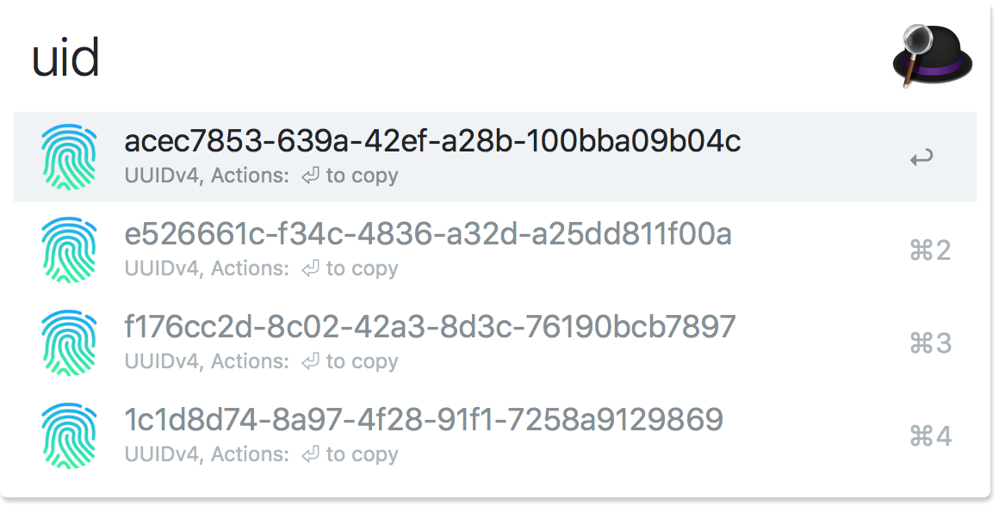

# alfred-uuid [](https://travis-ci.org/MariusRumpf/alfred-uuid)

> [Alfred](https://www.alfredapp.com) workflow to generate UUIDs in v1 and v4



## Install

```
$ npm install --global alfred-uuid
```

*Requires [Node.js 8+](https://nodejs.org) and [Alfred 3 or 4](https://www.alfredapp.com/) with the paid [Powerpack](https://www.alfredapp.com/powerpack/) upgrade.*


## Usage

In Alfred, type `uid`, <kbd>⏎</kbd>
- press <kbd>⏎</kbd> to copy a uuid.


## Related

- [uuid](https://github.com/kelektiv/node-uuid) - Package used to generate uuids

## License

MIT © [Marius Rumpf](https://github.com/mariusrumpf)

<p align="center"></p>
